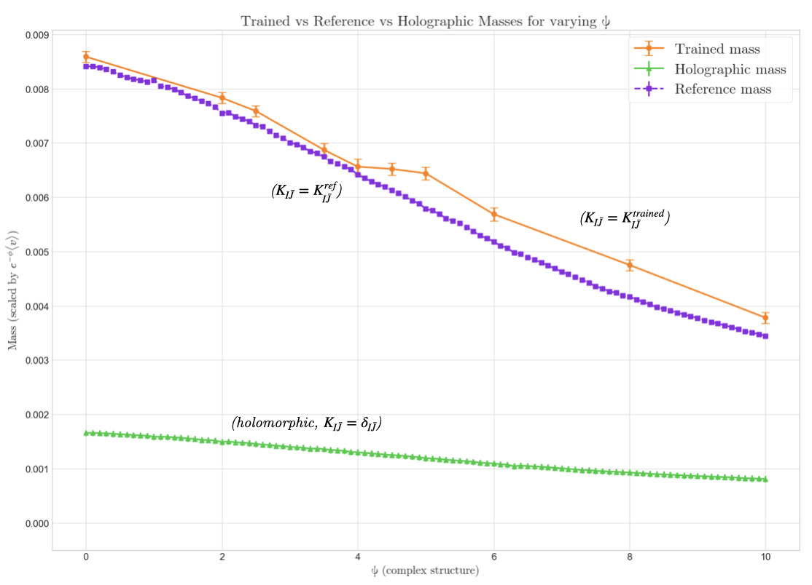

# heteroticyukawas 

heteroticyukawas is a package designed to calculate the Yukawa couplings/quark masses of general line bundles on the tetraquadric. Necessary inputs are the complex and K\"ahler moduli, line bundle indices, and closed representatives of the 1-form bundle cohomology.

Given that, it calculates, using NN models in TensorFlow, Calabi-Yau metrics, bundle metrics and harmonic representatives of the cohomology. It is based off cymetric, a Python package for learning of moduli-dependent Calabi-Yau metrics using neural networks implemented in TensorFlow.

A calculation can be replicated by navigating to `heteroticyukawas/heteroticyukawas` setting the moduli in `generate_and_train_all_nnsHOLO.py`, setting the settings in `Model_13_Do.py`, and then simply running:

```console
source ~/cymetric/bin/activate
python Model_13_Do.py 0.0000 'phi'
```

This calculates the matter fields Yukawa couplings for the second model in the [per](https://), for the stabilised value of the K\"ahler moduli, and for complex structure modulus $\psi=0$.

# Example output of calculation




## Installation
This guide assumes that you have a working Python 3 (preferably python 3.7 or above) installation (and Sage and Mathematica, if you want to use these features as well). So running ```python3``` should work on your system. Moreover, it assumes that you have installed git. Note that both are standard on Mac and most Linux distributions. For Windows, you will typically have to install them and make sure that for example Python works correctly with Mathematica if you are planing on using the Mathematica interface.

### 1. Install it with Python
If you want to use any existing python installation (note that we recommend using a virtual environment, see below), just run in a terminal
```console
pip install git+https://github.com/kitft/heteroticyukawas.git
```

To run the example notebooks, you need jupyter. You can install it with
```console
pip install jupyter notebook
```

### 2. Install with virtual environment
#### Using standard virtual environment
Create a new virtual environment in a terminal with

```console
python3 -m venv ~/cymetric
```

Then install with pip directly from github 

```console
source ~/cymetric/bin/activate
pip install --upgrade pip
pip install git+https://github.com/kitft/heteroticyukawas.git
pip install jupyter notebook
python -m ipykernel install --user --name=cymetric
```

#### Using anaconda
Create a new environment with

```console
conda create -n cymetric python=3.9
```

Then install with pip directly from github 

```console
conda activate cymetric
pip install git+https://github.com/pythoncymetric/cymetric.git
```

## Conventions and normalizations
We summarize the mathematical conventions we use in [this .pdf file](./assets/conventions.pdf).

## Contributing

We welcome contributions to the project. Those can be bug reports or new features, 
that you have or want to be implemented. Please read more [here](CONTRIBUTING.md).

## Citation

You can find our paper on the [arXiv](https://arxiv.org/abs/2111.01436). It will be presented at the [ML4PS workshop](https://ml4physicalsciences.github.io/2021/) of [NeurIPS 2021](https://neurips.cc/Conferences/2021/Schedule?showEvent=21862). If you find this package useful in your work, cite the following bib entry:

```
@article{Larfors:2021pbb,
    author = "Larfors, Magdalena and Lukas, Andre and Ruehle, Fabian and Schneider, Robin",
    title = "{Learning Size and Shape of Calabi-Yau Spaces}",
    eprint = "2111.01436",
    archivePrefix = "arXiv",
    primaryClass = "hep-th",
    reportNumber = "UUITP-53/21",
    year = "2021",
    journal = "Machine Learning and the Physical Sciences, Workshop at 35th NeurIPS",
}
```
